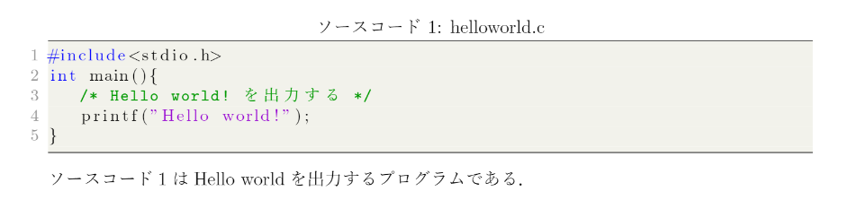

# LatexTemplateCU21T
 
 n4cr4が普段利用しているテンプレート
 
# DEMO
 
 このテンプレートを利用すれば画像のようなコードブロック、画像貼り付け、表の作成が可能です．
 <div style="text-align: center;"></div>
 <div style="text-align: center;"></div>
 <div style="text-align: center;"></div>
 
# Requirement
 
* platex
* dvipdfmx

上記2つはtexliveがインストールされていれば問題なく利用できます．

* jlisting

別途インストールが必要になります．jvlistingではコードブロック内の日本語のコメントアウトに色付けがされない現象が発生します．
 
# Installation
 
ubuntuでのインストール方法のみ紹介します．他のOSを利用している場合は適宜読み替えてください．
 
 * texliveのインストール
```bash
sudo apt install texlive-full
```
* jlistingのインストール
```bash
curl https://osdn.net/projects/mytexpert/downloads/26068/jlisting.sty.bz2/ -o jlisting.sty.bz2 -L
bzip2 -d jlisting.sty.bz2
sudo mv ~/jlisting.sty ./
sudo chmod 644 jlisting.sty
sudo mktexlsr
``` 

# Usage
 
 texファイルのコードをコピペしてください．ローカルでこのコードを利用したい場合は以下のコマンドを利用してください．
 
```bash
git clone https://github.com/n4cr4/LatexTemplateCU21T
```